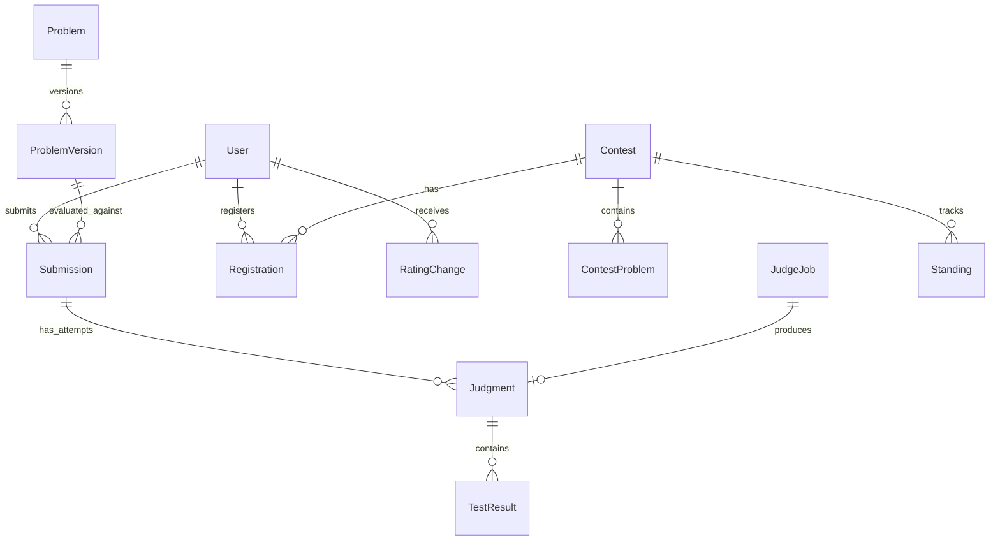
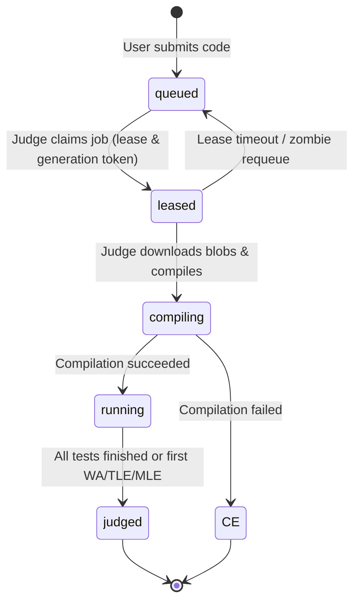
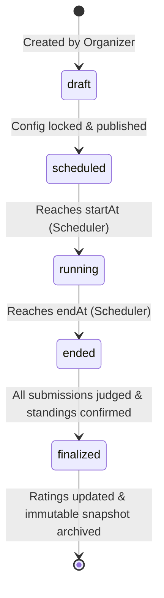

# Dagna (ዳኛ) Domain Model & State Transitions

## 1. Domain Entities & Relationships (ERD)

```mermaid
erDiagram
    User ||--o{ Submission : submits
    User ||--o{ Registration : registers
    User ||--o{ RatingChange : receives
    Contest ||--o{ Registration : has
    Contest ||--o{ ContestProblem : contains
    Problem ||--o{ ProblemVersion : versions
    ProblemVersion ||--o{ Submission : evaluated_against
    Submission ||--o{ Judgment : has_attempts
    Judgment ||--o{ TestResult : contains
    JudgeJob ||--o| Judgment : produces
    Contest ||--o{ Standing : tracks
```

## 2. Submission State Machine

```mermaid
stateDiagram-v2
    [*] --> queued: User submits code
    queued --> leased: Judge claims job (lease & generation token)
    leased --> compiling: Judge downloads blobs & compiles
    compiling --> CE: Compilation failed
    compiling --> running: Compilation succeeded
    running --> judged: All tests finished or first WA/TLE/MLE
    leased --> queued: Lease timeout / zombie requeue
    judged --> [*]
    CE --> [*]
```

## 3. Contest State Machine

```mermaid
stateDiagram-v2
    [*] --> draft: Created by Organizer
    draft --> scheduled: Config locked & published
    scheduled --> running: Reaches startAt (Scheduler)
    running --> ended: Reaches endAt (Scheduler)
    ended --> finalized: All submissions judged & standings confirmed
    finalized --> [*]: Ratings updated & immutable snapshot archived
```
